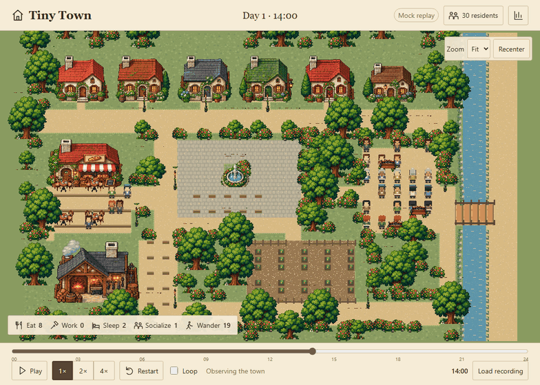
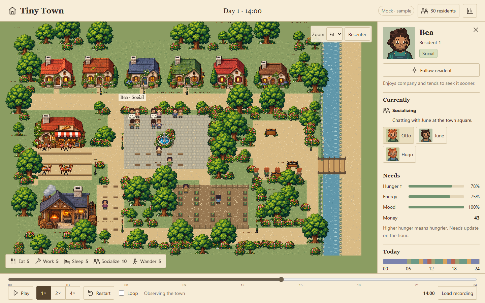
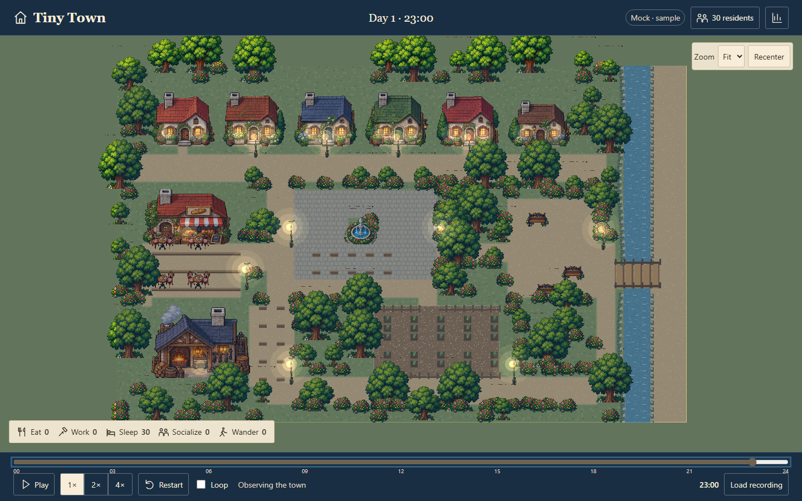
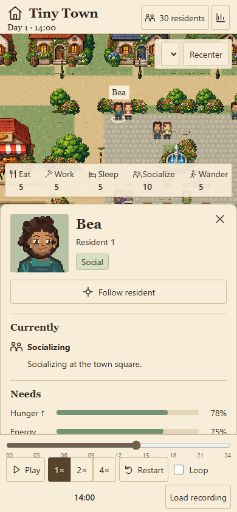

# Tiny Town

Tiny Town is a cozy little village where 30 neighbors live their own lives, with no player telling them what to do. Watch them eat, work, sleep, chat and wander as their needs and personalities shape the day.



*A glimpse of the town, recorded from a mock simulation.*

**[Play Tiny Town in your browser](https://khushi09-oss.github.io/jev-town/)** · No installation or API key needed.

## A look around

Daytime, with Bea selected:



Nighttime, with warm windows and street lamps:



Mobile:



These screenshots use a staged mock recording for visual testing. The live site and example export use a complete mock simulation.

## Run it locally

Open the included example without installing anything:

```powershell
Start-Process .\examples\town.html
```

To generate your own day, install Python and Node.js. Tested with Python 3.14 and Node 24.11.1. From the project root:

```powershell
python -m venv .venv
.\.venv\Scripts\Activate.ps1
python -m pip install -r requirements.txt
npm --prefix frontend ci
npm --prefix frontend run build
python town.py --mock --no-show --seed 7
Start-Process .\town.html
```

Each run creates `town.html` (offline replay), `town.png` (chart) and `run.json` (recording). These root outputs are ignored by Git; the committed sample lives in `examples/`. Use `--output-dir .\my-run` to save elsewhere.

`--mock` skips Jev and `.env` loading. `--no-show` saves the chart without opening a blocking window. Without a frontend build, Python reports that it is using the retained legacy animation exporter.

## Where things live

```text
jev-town/
├── town.py              # Run the simulation and export a day
├── requirements.txt     # Python dependencies
├── simulation/          # Identities, world, recordings and exports
├── frontend/            # TypeScript/Vite/Phaser replay, UI and game art
├── scripts/             # Rebuild navigation, artwork and test recordings
├── tests/               # Python tests, occupancy fixtures and visual reports
├── assets/              # Original art source and design references
├── examples/            # One ready-to-open replay, chart and recording
└── README.md
```

The frontend keeps its browser tests and screenshot baselines alongside its code. Runtime artwork is in `frontend/src/assets/`; original scenery is in `assets/source/`, with the design board and resident preview in `assets/reference/`. Only this README is tracked among Markdown files. Local handoff documents and `AGENTS.md` stay private to the workspace.

## Work on the viewer

Python runs the simulation. Jev chooses actions; Python applies their consequences and destinations. The browser replays a saved day. Playback controls never call Jev.

```powershell
npm --prefix frontend run dev
```

Open the URL printed by Vite. **Load recording** opens a generated `run.json`; invalid files leave the previous replay usable. `?stage=six` shows the six-resident art checkpoint.

Space toggles playback, Escape closes panels, and arrow keys pan the focused map. Zoom, follow, seek, speed, restart and loop all reuse the same recording. Reduced motion is supported.

## Test it

Run from the root, with the virtual environment active:

```powershell
python -m unittest -v
npm --prefix frontend test
npm --prefix frontend run build
Set-Location .\frontend
npx playwright install chromium
Set-Location ..
python town.py --mock --no-show --output-dir .\.artifacts\export
npm --prefix frontend run test:browser
```

Checks cover decisions and errors, all 30 residents choosing each action, path obstacles and the bridge, deterministic playback, keyboard/mobile controls, imported files and offline HTML. Fixed Windows/Chromium screenshots cover desktop 1440×900 and mobile 390×844. Reports and baseline hashes live in `tests/visual/`.

To rebuild generated game data and artwork after editing their sources:

```powershell
python scripts/build_world.py
python scripts/build_art.py
python scripts/make_visual_fixture.py
```

The scripts reuse the original scenery atlas; they do not call an image service. Art provenance is recorded in `frontend/src/assets/LICENSES.json`.

<details>
<summary><strong>Use Jev instead of mock decisions</strong></summary>

Keep your TypeSafe key in a local `.env` file. Never commit it or place it in browser code, screenshots or recordings. Example settings use a placeholder key:

```text
JEV_KEY=<your TypeSafe key>
JEV_URL=https://api.typesafe.ai/v1/systemone
JEV_MODEL=jev-latest
JEV_WORKERS=4
JEV_MIN_CONF=0.2
JEV_EFFECTS_PRESET=lively
JEV_ERROR_FALLBACK=stop
JEV_SOCIAL_MOOD=85
JEV_LAZY_REST=60
JEV_LAZY_WORK_MONEY=15
```

```powershell
Remove-Item Env:JEV_MOCK -ErrorAction SilentlyContinue
python town.py --no-show
```

With no key, the CLI uses mock decisions. A real 24-hour run makes about 720 requests, plus retries. HTTP 429/503/529 retries are bounded to six attempts, with 60-second request timeouts and numeric Retry-After waits capped at 60 seconds. Diagnostics redact the configured key.

Lazy residents favor rest, social residents seek company, and workaholics favor work. `lively` effects make mood decline during work and wandering; `legacy` restores the original effects. Needs are clamped to 0–100 and money stays nonnegative.

Low confidence applies wander and records `fellBack`. HTTP/schema errors stop by default and preserve the previous complete recording. Explicit `JEV_ERROR_FALLBACK=mock` recovery records a separate error-mock source and error code, with no valid API choice/confidence.

</details>

<details>
<summary><strong>Replay format, hosting and visual limits</strong></summary>

The version-1 recording contains stable identities, initial state and 24 ordered frames: 25 boundaries. Each frame records before/after stats, chosen/applied action, confidence, fallback/error metadata and a Python destination. The browser validates the recording and reconstructs shortest routes deterministically. It never applies effects. Needs commit at each hour boundary; t=24 shows the final state.

The world uses 64×40 tiles at 16 pixels each. Every action has 30 distinct destinations, including individual beds in six shared cottages. Four-direction sprites and matching portraits retain each resident's appearance. Selecting a sleeper reveals their home interior.

GitHub Pages serves the approved self-contained replay from `gh-pages/index.html`, alongside `.nojekyll`. It hosts no Python service or API key. New exports must be published to that branch; merging source changes alone does not update the live site.

The artwork remains simpler than the concept faces, terrain is visibly gridded, landscaping is less organic, and the specified night tint is gentler than the board. Desktop fit can leave sage margins. The roughly 2.4 MB inline Phaser bundle produces an expected Vite size warning. Screenshot baselines lock the inspected implementation rather than claiming exact concept-board parity.

</details>
